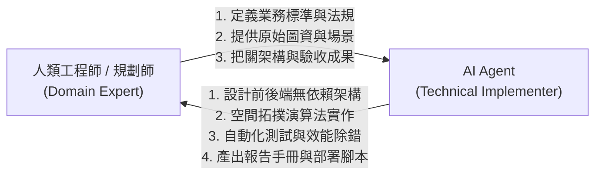

# 人行環境 WebGIS 平台：AI Agent 專案協作與高效提示詞實戰案例

> **文件定位**：本指南完整記錄了「人行環境 WebGIS 評估平台」從零到一的研發歷程，剔除除錯雜訊與贅字，將人機協作過程提煉為具體階段、提示詞典範（Prompt Examples）與實戰心法，供團隊同仁參考學習。

---

## 📖 目錄
1. [人機協作模式與核心思維](#一-人機協作模式與核心思維)
2. [六大專案實戰階段與提示詞剖析](#二-六大專案實戰階段與提示詞剖析)
   - [階段一：專案藍圖與法規架構擬定](#階段一專案藍圖與法規架構擬定)
   - [階段二：國土署空間分析演算法與數據管線](#階段二國土署空間分析演算法與數據管線)
   - [階段三：WebGIS 前端互動與五級分級視覺化](#階段三webgis-前端互動與五級分級視覺化)
   - [階段四：專業 A4 報告匯出與管理者權限系統](#階段四專業-a4-報告匯出與管理者權限系統)
   - [階段五：效能瓶頸排查與 98% 圖資極致節流優化](#階段五效能瓶頸排查與-98-圖資極致節流優化)
   - [階段六：多環境部署與雲端託管決策](#階段六多環境部署與雲端託管決策)
3. [給團隊同仁的高效提示詞 5 大黃金法則](#三-給團隊同仁的高效提示詞-5-大黃金法則)

---

## 一、 人機協作模式與核心思維

在傳統軟體開發中，從規格定義、演算法撰寫、前端 UI、除錯到部署往往耗時數週；而在 **「人類規劃師 + AI Agent 結對編程（Pair Programming）」** 模式下，兩者的分工角色如下：



* **人類角色（方向引導與業務把關）**：
  * 明確輸入資料規範（如國土測繪中心 SHP、高市事故點位、POI 類別）。
  * 嚴格定義業務演算法（如國土署《人行道改善優先度評估 2.0》正面評估公式）。
  * 審查產物品質，引導下一階段迭代。
* **AI Agent 角色（高效率技術執行）**：
  * 將複雜法規公式轉化為 Python 與 JavaScript 拓撲運算。
  * 解決底層依賴相容性（如 MapLibre GL、Turf.js、Proj4js 坐標轉換）。
  * 進行全鏈路排查與架構優化（如 Gzip 串流壓縮、按需載入機制）。

---

## 二、 六大專案實戰階段與提示詞剖析

---

### 階段一：專案藍圖與法規架構擬定

#### 🎯 階段目標
建立具備「單機免安裝 Node.js、原生 Python HTTP 服務、MapLibre 輕量向量地圖」的高擴充性 WebGIS 架構。

#### 💬 提示詞示範（Prompt）
```text
【任務情境】：
我們正在開發一套「人行環境 WebGIS 空間決策平台」，供政府機關與規劃人員評估道路人本交通改善優先度。

【技術限制與需求】：
1. 前端：使用純原生 HTML5 + CSS3 + JavaScript (ES6+)，搭配 MapLibre GL JS 與 Turf.js，嚴禁使用需要 npm build 的肥大框架（如 React/Vue）。
2. 後端：使用 Python 內建標準庫（http.server），提供空間分析 REST API，確保在無特定 Python 環境的電腦上也能一鍵執行。
3. 規範遵循：核心演算法必須嚴格符合國土署《人行道改善優先度評估 2.0 正面評估版 (V2)》。

請為我規劃完整的專案目錄結構、技術選型說明以及各模組的職責分工。
```

#### 💡 Agent 執行成果
* 規劃出清晰的職責分離架構：
  * `server/analysis_service.py`：純 Python 原生空間計算與靜態伺服。
  * `src/map.js`、`src/layers.js`、`src/dashboard.js`：模組化前端腳本。
  * `public/data/`：圖資分層儲存。

---

### 階段二：國土署空間分析演算法與數據管線

#### 🎯 階段目標
處理全高雄市 12M+ 道路、人行道多邊形、事故點、人口網格與 POI 資料，並實作框選即時拓撲分析。

#### 💬 提示詞示範（Prompt）
```text
【任務情境】：
我們需要實作使用者在前端地圖「任意框選多邊形（Polygon）」後，後端進行即時空間分析的 API。

【計算邏輯與公式】：
請依國土署 2.0 規範計算四大面向綜合得分（滿分 100 分）：
1. 需求性（30%）：依框選範圍內「最小統計區」的面積重疊比例，分攤計算總人口數與人口密度。
2. 風險性（25%）：空間關聯近三年 (111-113) A1/A2 事故點位，加權計算事故風險指數。
3. 現況人行環境（30%）：計算框選範圍內實體人行道長度、淨寬不足比率（< 1.5m）、破損與占用扣分。
4. 生活圈吸引力（15%）：計算通用地圖 7 大類生活圈 POI 聚集度。

【輸出需求】：
回傳標準 JSON，包含各分項得分、等級（A/B/C/D/E）與統計指標，計算時間需在 300ms 以內。
```

#### 💡 Agent 執行成果
* 建立 `SpatialEngine` 模組，使用 R-tree 空間索引大幅加速點與多邊形的拓撲交集運算。
* 後端無縫支援 TWD97 (EPSG:3826) 與 WGS84 (EPSG:4326) 坐標自動轉換。

---

### 階段三：WebGIS 前端互動與五級分級視覺化

#### 🎯 階段目標
提供直覺的國土測繪中心 (NLSC) WMTS 底圖切換、圖層順序拖曳、透明度滑桿、事故/POI 篩選與五級色彩渲染。

#### 💬 提示詞示範（Prompt）
```text
【任務情境】：
優化前端圖資管理面板與地圖渲染互動。

【功能清單】：
1. 底圖切換：整合 NLSC 通用電子地圖、正射影像圖與白底圖。
2. 五級品質分級：道路路網依分數套用綠 (#2ecc71)、黃 (#f1c40f)、橘 (#e67e22)、紅 (#e74c3c) 等級色彩。
3. POI 與事故篩選：提供下拉複選選單，勾選/取消時即時用 MapLibre setFilter 篩選點位。
4. 圖層順序：左側圖層列表支援滑鼠「拖曳排序 (Drag & Drop)」與「▲ / ▼ 按鈕」，調整後地圖繪製層級（Z-Index）需即時連動同步。
```

#### 💡 Agent 執行成果
* 實作 `initLayerOrderControls()` 與 `syncMapLayerOrder()`，完美同步 DOM 列表順序與 WebGL 圖層順序。
* 增加 POI 七大類分類篩選與事故 A1/A2 分流控制。

---

### 階段四：專業 A4 報告匯出與管理者權限系統

#### 🎯 階段目標
產出符合公部門審查規格的「A4 橫式評估報告（PDF/列印）」與 SQLite 後台管理審核機制。

#### 💬 提示詞示範（Prompt）
```text
【任務情境】：
使用者完成生活圈分析後，需要匯出一份完整的評估報告送交主管機關審查。

【設計規範】：
1. 版面：標準 A4 橫向（297mm x 210mm），排版需包含：案件基本資訊、高解析度地圖截圖、四大面向得分雷達圖、詳細統計數據表格、改善建議。
2. 技術要求：避免調用後端肥大套件，改用 html2canvas 或前端視窗列印樣式 (@media print)，解決列印時地圖黑屏或瓦片未載入問題。
3. 帳號權限：建立簡易 SQLite 管理者系統（Admin/Viewer），支援使用者登入、上傳審查資料與案件管理。
```

#### 💡 Agent 執行成果
* 開發 `report_export.js`：透過動態隱藏 UI、調整地圖容器至固定 A4 比例（1400x700px）並等待 WebGL 渲染完成後觸發列印，達到 100% 向量清晰度。
* 建立 `server/admin.db` 與 `src/admin.js` 提供完整的 RBAC 權限管理。

---

### 階段五：效能瓶頸排查與 98% 圖資極致節流優化

#### 🎯 階段目標
解決線上部署時，每開啟一次首頁消耗 57 MB 流量、導致免費額度迅速耗盡的痛點。

#### 💬 提示詞示範（Prompt）
```text
【問題現象】：
我們的網站部署到線上後，測試幾次流量就高達好幾 GB 甚至被平台停機。請深入排查前端載入流程與後端資源傳輸，找出流量黑洞並提出最佳優化方案。
```

#### 💡 Agent 除錯與解決過程
1. **問題定位**：
   * 排查發現 `src/layers.js` 在首頁載入時預設勾選了 159 MB 的人行道多邊形（Polygon）圖資（壓縮後仍有 49 MB）。
   * 程式碼在背景使用迴圈預載了所有未開啟圖層（村里界、人口、POI、事故），造成每次開啟強制下載 ~57 MB。
2. **重構實施**：
   * **首頁僅載入核心**：預設僅載入 12M+ 道路評估路網（`road_priority.geojson.gz` 僅 1.1 MB）。
   * **改為隨選隨載（On-Demand）**：人行道、POI、人口等圖層改為使用者在側邊欄主動勾選時才非同步抓取。
   * **配置長效快取**：後端加入 `Cache-Control: public, max-age=604800`（7 天快取）。
3. **優化成效**：
   * 首頁流量由 **57 MB 驟降至 1.1 MB（節省 98.1% 頻寬）**，重複開啟消耗 0 MB。

---

### 階段六：多環境部署與雲端託管決策

#### 🎯 階段目標
評估並實施 24 小時免開機雲端託管，同時保留本地極速運行與外網穿透備援。

#### 💬 提示詞示範（Prompt）
```text
【任務情境】：
我們需要將這個專案部署至雲端，要求：
1. 即使工程師電腦關機，外部人員與主管依然 24 小時隨時可連線訪問。
2. 評估 Koyeb、Render、Zeabur 等雲端託管平台之免費額度與適用性。
3. 準備一鍵部署設定檔（如 Procfile、requirements.txt），並提供本機 Cloudflare 外網穿透作為離線展示備援。
```

#### 💡 Agent 執行成果
* 建立標準 `Procfile`，適配雲端動態 `PORT` 與 `HOST=0.0.0.0`。
* 製作 `啟動本機WebGIS公網連線.bat`（內嵌 Cloudflare Tunnel），提供雙軌備援方案。

---

## 三、 給團隊同仁的高效提示詞 5 大黃金法則

為了讓同仁在日常工作與 AI Agent 協作時能達到最高效率，歸納以下五大心法：

### 1. 法則一：錨定角色與專業領域（Define Context & Role）
* ❌ **模糊問法**：「幫我寫一個計算人行道的程式。」
* ✅ **高效問法**：「你是一位資深 GIS 架構師。請依據內政部國土管理署《人行道改善優先度評估 2.0》正面評估標準，設計一個計算淨寬合規率與鋪面破損扣分的演算法。」

### 2. 法則二：明確輸入與輸出規格（Explicit I/O Boundaries）
* ❌ **模糊問法**：「我要匯出報表。」
* ✅ **高效問法**：「請實作一個前端匯出功能，點擊後將目前地圖與 ECharts 雷達圖排版為 A4 橫向 PDF 格式，需包含專案名稱、評估日期與統計表格，且不可依賴後端伺服器運算。」

### 3. 法則三：小步快跑、漸進迭代（Incremental Iteration）
* 避免一次性要求 Agent 完成 20 個功能。建議按步驟推進：
  1. **步驟一**：先跑通最基本的地圖顯示與 GeoJSON 讀取。
  2. **步驟二**：加入空間拓撲交集運算。
  3. **步驟三**：美化 UI、加入圖層拖曳與圖表。
  4. **步驟四**：進行效能優化與邊界測試。

### 4. 法則四：現象導向的精準除錯（Symptom-Oriented Debugging）
* 遇到 Bug 時，提供具體數據、錯誤日誌或封包大小：
* ❌ **模糊問法**：「網站跑好慢，而且流量一下子就沒了。」
* ✅ **高效問法**：「檢視 Network 面板發現初次載入消耗了 57 MB，其中 sidewalk.geojson 佔了 49 MB。請調整載入策略，改為只有在勾選 Checkbox 時才發出 fetch 請求。」

### 5. 法則五：產物驅動交付（Artifacts-Driven Delivery）
* 在提示詞最後要求明確的交付產物格式：
  * 「請提供可直接覆蓋的檔案內容，並指出修改行數。」
  * 「請將架構說明整理為繁體中文 Markdown 說明手冊與 PowerPoint 簡報大綱。」

---

> **專案儲存庫**：[https://github.com/YTCheng0507/HCTWebGISdemo](https://github.com/YTCheng0507/HCTWebGISdemo)  
> **技術團隊**：人行環境 GIS 決策平台研發組
