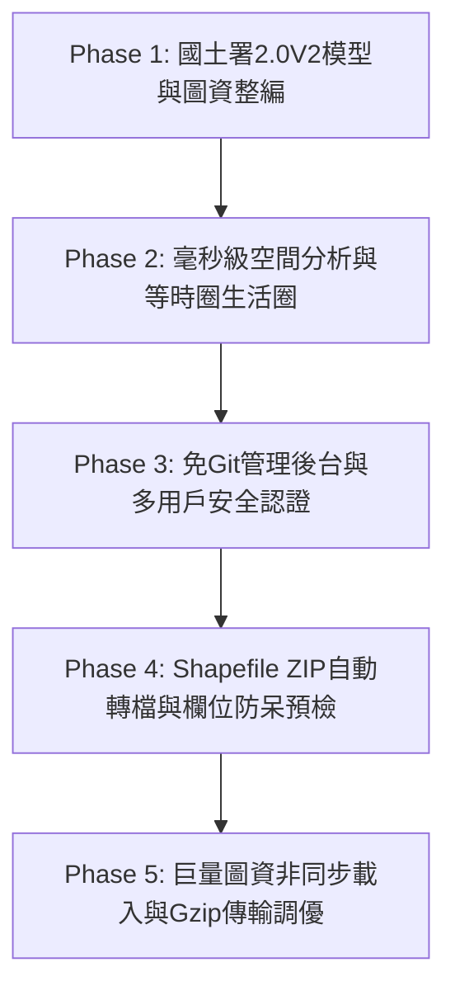

# 人行環境 WebGIS 資料平台：全架構建置指南與最佳實踐手冊

> **文檔版本**：v2.0 (全功能完成版)  
> **適用場景**：全新專案快速落地、跨縣市系統快速移植、以最低 Token 與開發成本完成高效能空間決策平台建置。

---

## 目錄
1. [從零到一：全生命週期建構與踩坑除錯歷程](#一從零到一全生命週期建構與踩坑除錯歷程)
2. [前置準備清單：資料、欄位規範與環境設定](#二前置準備清單資料欄位規範與環境設定)
3. [技術選型評估：前端、後端與託管方案](#三技術選型評估前端後端與託管方案)
4. [極致效率提示詞（Minimal-Token Prompt Playbook）](#四極致效率提示詞minimal-token-prompt-playbook)

---

## 一、從零到一：全生命週期建構與踩坑除錯歷程

本平台的建置歷經五大核心階段，記錄了從最初的空間模型確立，到最後的極致效能調優與權限安全防護。



### 1.1 Phase 1：評鑑模型確立與巨量圖資整編
- **目標**：以內政部國土署《人行道改善優先度 2.0 V2》為核心，建立正面評價五級分制（A~E級）。
- **圖資整合**：整併高雄市 7 大圖資：
  1. 12公尺以上優先道路改善成果（線）
  2. 人行道實體普查面圖資（80,572 筆 Polygon，原始大小 159 MB）
  3. 近三年交通事故點（A1 死亡 / A2 受傷）
  4. 通用電子地圖 7 大分類生活機能 POI
  5. 最小統計區常住人口與密度
  6. 38 個行政區界線
  7. 904 個村里界線
- **關鍵踩坑與解決**：
  - **坐標系不一致**：台灣公部門圖資常為 **TWD97 二度分帶 (EPSG:3826)**，而現代 WebGIS 底圖規範為 **WGS84 經緯度 (EPSG:4326)**。
  - **解法**：確立架構原則 ——「**前端呈現一律用 WGS84，後端空間距離/面積運算一律以 TWD97 公尺制計算**」，透過 `pyproj` / `Proj4js` 進行透明轉換。

---

### 1.2 Phase 2：空間分析引擎與等時圈生活圈
- **目標**：提供「任意手繪多邊形、矩形、圓形」以及「指定坐標的 5~20 分鐘步行等時圈」生活圈試算。
- **關鍵踩坑與解決**：
  - **稀有特例 POI 干擾計分**：某些點位（如監獄、焚化爐）雖屬 POI，但不屬於常態步行生活機能。
  - **解法**：在後端引入 `IS_SCOREABLE` 篩選，過濾稀有設施，並動態分攤統計區人口面積比，實現毫秒級真實加權計算。

---

### 1.3 Phase 3：免 Git 純網頁管理後台與安全性升級
- **目標**：為非技術背景的行政同仁提供「純網頁一鍵維護」，杜絕終端機操作門檻。
- **關鍵踩坑與解決**：
  - **預設密碼外洩風險**：使用者要求不可直接在登入介面上顯示或寫死預設帳密。
  - **權限越權風險**：一般維護員不應看到稽核軌跡或修改他人帳號。
  - **解法**：
    1. 移除前端所有預設密碼文字。
    2. 引入 `SQLite` + `PBKDF2-HMAC-SHA256` 密碼鹽值雜湊認證，簽發 24 小時 Bearer Token。
    3. 實施角色分級：超級管理員（`superadmin`）專屬帳號管理與稽核日誌；一般人員（`maintainer`）僅可置換圖資與微調權重。

---

### 1.4 Phase 4：Shapefile ZIP 自動轉檔與 Pre-flight 欄位預檢
- **目標**：支援公部門最常見的 Shapefile 套裝（.shp, .shx, .dbf, .prj）打包成 `.zip` 直接上傳，並在上線前自動診斷是否缺少核心欄位。
- **關鍵踩坑與解決**：
  - **字元亂碼問題**：早期 Shapefile 常以 `Big5 (CP950)` 儲存中文，直接讀取會崩潰。
  - **誤傳缺欄位圖資造成系統分析崩潰**：若上傳的人行道缺少 `SWW_WTH`（有效淨寬），空間分析會直接拋出例外。
  - **解法**：
    1. 後端自動偵測編碼（優先 `utf-8`，失敗回退 `cp950`）。
    2. 建立 `LAYER_SCHEMAS` 規格字典，設計 **Pre-flight 預檢機制**：缺少欄位時跳出紅字警告、顯示具體用途與 QGIS/ArcGIS 修復教學，並**強制鎖定上傳按鈕**。

---

### 1.5 Phase 5：首頁凍結排查、非同步載入與透明 Gzip 串流
- **目標**：解決「網頁剛打開時當住，除了移動地圖外，左側按鈕與分頁都按不了」的致命問題。
- **關鍵踩坑與解決**：
  - **致命阻塞原因**：`DOMContentLoaded` 中執行了 `await layerMgr.loadCountyLayers('kaohsiung')`，依序同步下載 190.5 MB 圖資（人行道高達 159 MB）。雖然地圖畫布提早出來了，但**分頁按鈕、側欄收合、管理員按鈕等事件監聽器根本還沒執行到綁定代碼**！
  - **解法**：
    1. **事件監聽器 0 毫秒立即綁定**：地圖初始化後，所有 UI 按鈕與工具模組先同步註冊完成，圖資載入挪至最後以非同步 `Promise` 在背景執行。
    2. **分級加載**：優先載入 12米道路（3.9 MB，0.2秒渲染完成全市道路網與路名搜尋）；人行道（159 MB）直接交由 MapLibre 內核 WebWorker 在背景線程切片，主線程完全不卡頓；其他未勾選圖層延遲隨選加載（On-demand / Lazy Loading）。
    3. **透明 Gzip 串流**：後端新增 `Accept-Encoding: gzip` 支援，將靜態 `.geojson` 以預壓製的 `.geojson.gz` 傳輸，**總體積由 190.5 MB 驟降至 55 MB（節省 70% 頻寬）**，本機 0.1 秒傳完，線上載入速度翻 3 倍。
    4. **樣式修復**：清除 `#admin-tab-upload` 標籤上的行內 `display: flex`，解決切換分頁時圖資上傳介面殘留在所有頁面的問題；將地圖 Pop up 寬度上限擴展至 380px 並加入 `white-space: nowrap`，解決「(第 367 名)」換行斷字問題。

---

## 二、前置準備清單：資料、欄位規範與環境設定

在向 AI 下達建置指令或全新部署平台前，請備妥以下資產清單：

### 2.1 必備圖資與核心屬性欄位表（Schema Spec）

| 圖資類別 (`layer_key`) | 幾何類型 | 預設檔案名稱 | 核心必要欄位 (缺少則無法計算) | 欄位業務說明 |
| :--- | :---: | :--- | :--- | :--- |
| **人行步道** (`sidewalk`) | Polygon / Line | `sidewalk.geojson` | `SWW_WTH`<br>`SW_AREA`<br>`SW_BRKRAT`<br>`SW_BK_B`<br>`SW_BK_L` | • 有效淨寬 (m，門檻1.5m)<br>• 鋪面面積 (m²)<br>• 鋪面破損率 (%)<br>• 磚體鬆動 B / L 扣分指標 |
| **優先改善路廊** (`road_priority`) | LineString | `road_priority.geojson` | `ROADNAME_F`<br>`I_TOTAL`<br>`PRIORITY`<br>`RANK` | • 道路名稱 (全域搜尋用)<br>• 綜合優先度分數 (0~100)<br>• 改善優先等級與全市名次 |
| **交通事故點** (`accidents`) | Point | `accidents.geojson` | `ACC_TYPE`<br>`YEAR`<br>`DEAD_CNT`<br>`INJ_CNT` | • 事故型態 (A1/A2)<br>• 事故年度 (近三年)<br>• 死亡 / 受傷人數 |
| **生活機能 POI** (`poi`) | Point | `poi.geojson` | `POI_NAME`<br>`TYPE`<br>`IS_SCOREABLE` | • 設施名稱<br>• 通用圖7大類別<br>• 計分旗標 (1=計分, 0=稀有特例) |
| **最小統計區人口** (`population_bsa`) | Polygon | `population_bsa.geojson`| `P_CNT`<br>`H_CNT`<br>`CODEBASE` | • 戶籍人口數<br>• 戶數<br>• 統計區代碼 (人口密度分攤) |
| **行政區界** (`town_boundary`) | Polygon | `town_boundary.geojson`| `TOWNNAME`<br>`COUNTYNAME` | • 鄉鎮市區名<br>• 縣市名稱 |
| **村里界線** (`village_boundary`) | Polygon | `village_boundary.geojson`| `VILLNAME`<br>`TOWNNAME` | • 村里名稱<br>• 所屬行政區名 |

---

### 2.2 系統與套件環境配置

#### 後端環境需求 (Python 3.10 ~ 3.12)
```txt
# requirements.txt
geopandas>=0.14.0
shapely>=2.0.0
pyproj>=3.6.0
pandas>=2.0.0
# 註：標準庫包含 http.server, sqlite3, hashlib, secrets, gzip, zipfile，無需額外安裝
```

> [!TIP]
> **Windows 本機開發特別提醒**：
> 若本機安裝 QGIS，可直接調用 QGIS 內建之 Python 環境（例如 `C:\Program Files\QGIS 4.x\apps\Python312\python.exe`），自帶齊全的 GDAL / GEOS / PROJ 二進位依賴，省去本機安裝編譯之困擾。

#### 前端第三方函式庫（全以 CDN 引用，零打包工具依賴）
- **MapLibre GL JS**：`v3.6.2`（地圖核心渲染引擎）
- **Mapbox GL Draw**：`v1.4.3`（向量繪圖交互模組）
- **Turf.js**：`v6.5.0`（客戶端幾何計算：bbox, center, circle）
- **Proj4js**：`v2.9.0`（坐標系雙向定位校驗）
- **Apache ECharts**：`v5.4.3`（雷達圖、長條圖可視化 Dashboard）

---

## 三、技術選型評估：前端、後端與託管方案

本專案之所以能在極低資源下兼顧「流暢度」、「功能豐富度」與「零維護成本」，關鍵在於嚴謹的架構決策：

```mermaid
graph LR
    subgraph Client [前端瀏覽器]
        ML[MapLibre GL JS] -->|WebWorker向量切片| V[GPU Canvas渲染]
        UI[純原生JS模組<br>無框架零打包] --> ML
    end
    
    subgraph Server [後端伺服器 (Render/本地)]
        PY[Python ThreadingHTTPServer]
        SP[Shapely + GeoPandas<br>STRtree 記憶體空間索引]
        DB[(SQLite WAL<br>PBKDF2 認證)]
        GZ[靜態 .gz 透明串流]
    end
    
    Client <-->|REST API + Gzip GeoJSON| Server
```

| 維度 | 選用技術 | 為何這樣選？（核心優勢） | 放棄的替代方案與權衡理由 |
| :--- | :--- | :--- | :--- |
| **前端底圖引擎** | **MapLibre GL JS** | • 100% 開源無商用授權費（相比 Mapbox）。<br>• 原生 WebGL / WebWorker 向量切片，處理 8 萬筆人行道幾何依然 60 FPS 流暢。<br>• 支援原生套用台灣國土測繪中心 (NLSC) WMTS 圖資。 | **Leaflet**：Leaflet 在處理超過 5,000 筆多邊形時 DOM 節點會嚴重卡頓；<br>**Cesium**：過度笨重，行動裝置載入過慢。 |
| **前端架構模式** | **Vanilla JS (原生模組化)** | • 無需 Node.js / Vite / Webpack 打包編譯流水線。<br>• 部署即拷貝，檔案完全透明，便於任何公務機或局處內網直接開箱運作。 | **React / Vue**：打包後代碼難以直接在公部門內部進行快速微調與維護，且增加 CI/CD 構建負擔。 |
| **後端分析引擎** | **Python + GeoPandas + Shapely** | • 空間資料科學業界唯一標準。<br>• 使用 `STRtree` 空間索引常駐快取，框選裁切僅需 20~50 毫秒。<br>• 坐標系轉換極度精準（高斯-克呂格/橫麥卡托投影與經緯度校準）。 | **PostGIS / GeoServer**：配置繁重，伺服器每月需額外付出資料庫託管成本，不適合輕量級決策專案。 |
| **身分驗證與資料庫** | **SQLite (WAL 模式) + PBKDF2** | • 單一檔案資料庫，隨代碼一同備份，零連線管理與連接池洩漏風險。<br>• 安全性達銀行級標準（隨機鹽值 + 10 萬次雜湊疊代）。 | **PostgreSQL / MySQL**：過度設計，維護連線池與備份負擔大。 |
| **伺服器與通訊** | **ThreadingHTTPServer + 透明 Gzip** | • 原生 Python 內建多執行緒，零依賴即可啟動。<br>• 特製靜態檔案串流支援，自動識別 `.gz`，讓 159 MB 檔案壓縮到 49 MB 瞬間下載。 | **FastAPI / Django**：需要額外依賴 uvicorn/gunicorn，增加部署複雜度。 |
| **代碼託管與 CI/CD** | **GitHub + Git** | • 程式碼全版本歷史追蹤、分支保護與即時回滾。 | 傳統 FTP：無法追蹤異動紀錄，多人維護極易衝突。 |
| **雲端運算託管** | **Render.com (Web Service)** | • 免費提供原生 Linux 容器與公開 HTTPS 域名。<br>• 深度整合 GitHub，`git push` 自動觸發編譯與熱更新部署。 | AWS EC2 / GCP：設定複雜，需自行配置反向代理 Nginx、SSL 憑證與定期維護。 |

---

## 四、極致效率提示詞（Minimal-Token Prompt Playbook）

> **使用說明**：未來若要在其他縣市（如宜蘭、台東、新北）或新專案中重新架設此 WebGIS 平台，**請將以下提示詞複製並直接傳送給 AI**。  
> 這份提示詞已濃縮全部避坑經驗，能以**最少的 Token 次數**，指引 AI **一次到位**建立完整系統。

```markdown
# 任務：構建高效能「人行環境空間分析 WebGIS 平台」

請為我建立一套現代化、開箱即用的「人行環境空間分析與決策支援 WebGIS 平台」。
請嚴格遵照以下架構規範與避坑原則進行實作，杜絕常見的巨量圖資卡死與坐標偏移問題。

## 1. 核心架構約束（必須嚴格遵守）
1. 前端架構：採用原生 HTML5 + Vanilla ES6 模組化架構，完全不使用 React/Vue 等打包工具，以 CDN 引入 MapLibre GL JS (v3.6.2)、Turf.js (v6.5.0)、Apache ECharts (v5.4.3)。
2. 【關鍵避坑】前端事件綁定絕不阻塞：
   - 地圖初始化完成後，必須「立即同步綁定」所有 UI 點擊監聽器（分頁切換、側欄收合、管理員按鈕、圖層 Checkbox 等）。
   - 圖資載入必須以 Promise 於「背景非同步發起」，絕不可在 DOMContentLoaded 中同步 await 阻塞 UI 事件綁定！
3. 圖資載入優先級：
   - 第一優先：載入 12m 道路改善圖層（快速呈現全市路網與路名搜尋）。
   - 第二優先：實體人行道圖資直接以 URL 傳遞給 MapLibre Source，由 WebWorker 背景線程切片，禁止在主線程 await resp.json()。
   - 預設關閉之圖層（事故、POI、區界、村里界、人口）必須支援「隨選延遲載入 (On-demand Lazy Loading)」，勾選時才即時抓取。
4. 坐標系原則：
   - 前端地圖呈現一律為標準 WGS84 經緯度 (EPSG:4326)。
   - 後端空間運算（面積、長度、剪裁）一律轉換為 TWD97 二度分帶 (EPSG:3826) 進行公尺制計算。

## 2. 後端伺服器 (server/analysis_service.py)
1. 使用 Python 原生 ThreadingHTTPServer 搭配 GeoPandas + Shapely。
2. 啟動時於背景預熱載入圖資至記憶體，建立 STRtree 空間索引實現毫秒級剪裁。
3. 靜態圖資透明 Gzip 串流：
   - 在 do_GET 處理 .geojson 請求時，若請求頭帶有 Accept-Encoding: gzip 且磁碟存在對應的 .geojson.gz，直接以 Content-Encoding: gzip 串流傳輸該壓縮檔。
4. 核心 API：
   - POST /api/analysis：接收前端繪製之 Polygon GeoJSON，進行人口分攤、事故統計、人行道覆蓋與淨寬、POI豐富度分析，並輸出《人行環境改善優先度 2.0 V2》綜合評分 (A~E五級)。
   - POST /api/admin/login：PBKDF2 密碼雜湊驗證，簽發 24 小時 Bearer Token。
   - GET /api/admin/audit_logs：僅限 superadmin 權限查閱之安全稽核紀錄。
   - POST /api/admin/upload_layer：支援 Shapefile (.zip) 與 GeoJSON 線上置換。

## 3. 圖資規格與 Pre-flight 預檢防呆 (Schema Validator)
建立 LAYER_SCHEMAS 規則表，支援 7 大圖資：
1. sidewalk (Polygon): 必備 SWW_WTH, SW_AREA, SW_BRKRAT, SW_BK_B, SW_BK_L
2. road_priority (LineString): 必備 ROADNAME_F, I_TOTAL, PRIORITY, RANK
3. accidents (Point): 必備 ACC_TYPE, YEAR, DEAD_CNT, INJ_CNT
4. poi (Point): 必備 POI_NAME, TYPE, IS_SCOREABLE
5. population_bsa (Polygon): 必備 P_CNT, H_CNT, CODEBASE
6. town_boundary (Polygon): 必備 TOWNNAME, COUNTYNAME
7. village_boundary (Polygon): 必備 VILLNAME, TOWNNAME
上傳前前端自動執行預檢診斷，若缺少必要欄位跳紅字警告、顯示用途與 QGIS 修復指引，並鎖定確認上傳按鈕。

## 4. UI/UX 與細節要求
1. 版面採用左側多功能抽屜面板（四大分頁：圖層控制、框選分析、路名搜尋與坐標定位、評估報告導出），支援平滑折疊收合。
2. 地圖 Pop up 必須設置 maxWidth: '360px'，且排名欄位加入 white-space: nowrap，防止斷字折行。
3. 管理者控制台的分頁必須嚴格隔離，切換分頁時隱藏未選取的分頁內容，且「帳號管理」與「稽核日誌」僅在超級管理員登入時顯示。

請依此規範生成完整專案結構、設定檔與源代碼。
```

---

## 五、維護與擴充建議

1. **擴充新縣市步驟**：
   - 於 `public/data/<縣市英文代碼>/` 放入對應的 7 大圖資。
   - 於 `server/analysis_service.py` 執行預壓縮腳本生成對應的 `.geojson.gz`。
   - 於 `src/config.js` 的 `APP_CONFIG.counties` 註冊該縣市中心點經緯度、預設 Zoom 與資料夾路徑。
   - 重新啟動後台，新縣市即可無縫即時切換。
2. **定期維護**：
   - 定期於後台控制台查閱「📜 稽核日誌」，掌握同仁帳號異動與圖資置換歷程。
   - 定期備份 `server/admin.db`（SQLite 單檔），內含所有帳號雜湊與操作軌跡。
